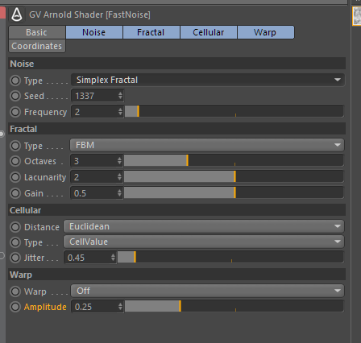
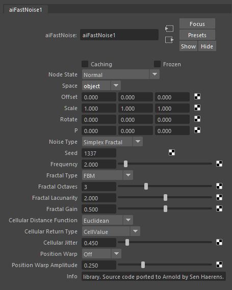
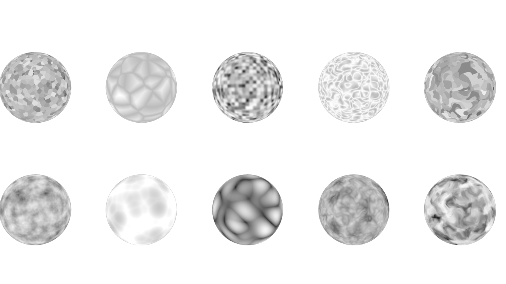

Arnold FastNoise
================

Arnold noise shader based on [Auburns Fastnoise](https://github.com/Auburns/FastNoise) library.  
[Download compiled binaries for Linux, Windows & MacOS](https://github.com/SenH/Arnold-FastNoise/releases/latest).

